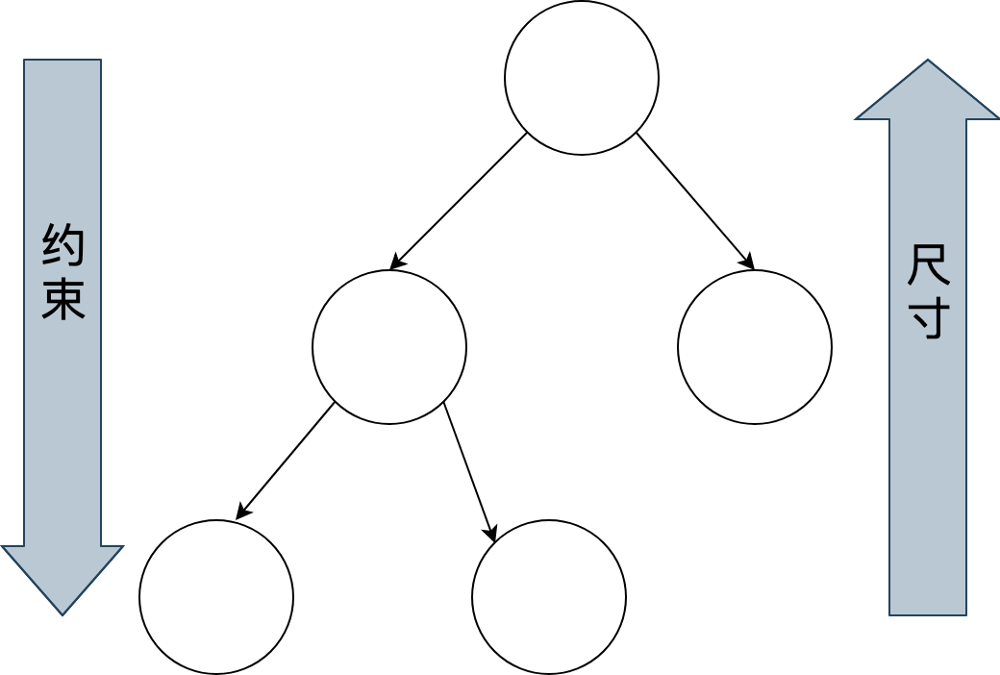
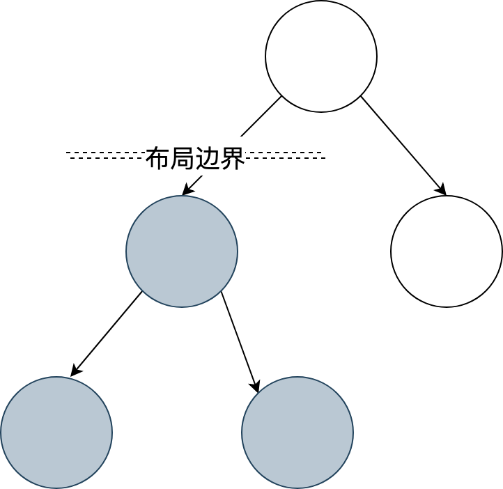
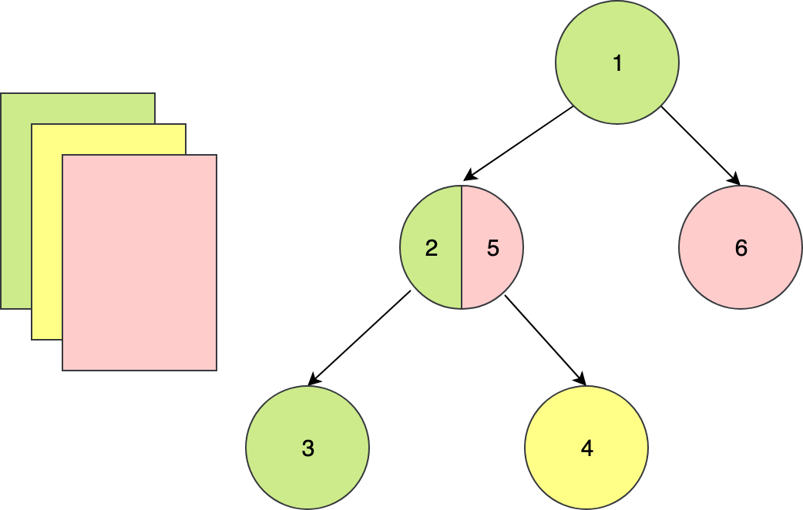
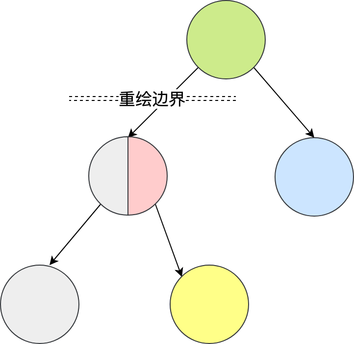

# flutter-learn

学习资料：
[flutter官网](https://flutter.dev/docs/get-started/install)
[极客时间课程](https://time.geekbang.org/column/intro/200?code=0NDBjgqiiw4VWefF8wtD-e1yhlWj5gG9ijWGD6ZH9KA%3D)，
[flutter实战](https://book.flutterchina.club/chapter2/first_flutter_app.html),
[flutterbyexample](https://flutterbyexample.com/about-flutter)

## 1. 在macOS上搭建Flutter开发环境

### 1.1. 获取Flutter SDK
[去flutter官网下载其最新可用的安装包](https://flutter.io/sdk-archive/#macos) 。

```text
cd ~/development
unzip ~/Downloads/flutter_macos_v0.5.1-beta.zip

```


添加flutter相关工具到path中：

```text
export PATH=`pwd`/flutter/bin:$PATH
```

#### 1.1.1. 运行 flutter doctor

该命令检查您的环境并在终端窗口中显示报告。Dart SDK已经在捆绑在Flutter里了，没有必要单独安装Dart。 仔细检查命令行输出以获取可能需要安装的其他软件或进一步需要执行的任

#### 1.1.2. 更新环境变量

1. 确定您Flutter SDK的目录，您将在步骤3中用到。
2. 打开(或创建) $HOME/.bash_profile. 文件路径和文件名可能在您的机器上不同.
3. 添加以下行并更改[PATH_TO_FLUTTER_GIT_DIRECTORY]为克隆Flutter的git repo的路径:

```text
export PUB_HOSTED_URL=https://pub.flutter-io.cn //国内用户需要设置
export FLUTTER_STORAGE_BASE_URL=https://storage.flutter-io.cn //国内用户需要设置
export PATH= PATH_TO_FLUTTER_GIT_DIRECTORY/flutter/bin:$PATH
```

注意：PATH_TO_FLUTTER_GIT_DIRECTORY 为你flutter的路径，比如“~/document/code”

```text
 export PATH= ~/document/code/flutter/bin:$PATH
```
4. 运行 source $HOME/.bash_profile 刷新当前终端窗口.
 *注意*: 如果你使用的是zsh，终端启动时 ~/.bash_profile 将不会被加载，解决办法就是修改 ~/.zshrc ，在其中添加：source ~/.bash_profile
 
5. 通过运行flutter/bin命令验证目录是否在已经在PATH中:

```text
echo $PATH
``` 

### 1.2. iOS 设置

#### 1.2.1 安装 Xcode

1. 要为iOS开发Flutter应用程序，您需要Xcode 7.2或更高版本:

2. 安装Xcode 7.2或更新版本.

配置Xcode命令行工具以使用新安装的Xcode版本 sudo xcode-select --switch /Applications/Xcode.app/Contents/Developer 对于大多数情况，当您想要使用最新版本的Xcode时，这是正确的路径。如果您需要使用不同的版本，请指定相应路径。

3. 确保Xcode许可协议是通过打开一次Xcode或通过命令sudo xcodebuild -license同意过了.

使用Xcode，您可以在iOS设备或模拟器上运行Flutter应用程序。

#### 1.2.2 设置iOS模拟器

1. 要准备在iOS模拟器上运行并测试您的Flutter应用，请按以下步骤操作：

在Mac上，通过Spotlight或使用以下命令找到模拟器:
```text
open -a Simulator
```
2. 通过检查模拟器 硬件>设备 菜单中的设置，确保您的模拟器正在使用64位设备（iPhone 5s或更高版本）.
3. 根据您的开发机器的屏幕大小，模拟的高清屏iOS设备可能会使您的屏幕溢出。在模拟器的 Window> Scale 菜单下设置设备比例
4. 运行 flutter run启动您的应用.


#### 1.2.3 安装到iOS设备

要将您的Flutter应用安装到iOS真机设备，您需要一些额外的工具和一个Apple帐户，您还需要在Xcode中进行设置。

1. 安装 homebrew （如果已经安装了brew,跳过此步骤）.
2. 打开终端并运行这些命令来安装用于将Flutter应用安装到iOS设备的工具

```text
brew update
brew install --HEAD libimobiledevice
brew install ideviceinstaller ios-deploy cocoapods
pod setup
```


### 1.3 Android设置

#### 1.3.1 Flutter需要安装和配置Android Studio:

1. 下载并安装 Android Studio.

2. 启动Android Studio，然后执行“Android Studio安装向导”。这将安装最新的Android SDK，Android SDK平台工具和Android SDK构建工具，这是Flutter为Android开发时所必需的


#### 1.3.2 设置您的Android设备
要准备在Android设备上运行并测试您的Flutter应用，需要安装Android 4.1（API level 16）或更高版本的Android设备.

1. 在您的设备上启用 开发人员选项 和 USB调试 。详细说明可在Android文档中找到。
2. 使用USB将手机插入电脑。如果您的设备出现提示，请授权您的计算机访问您的设备。
3. 在终端中，运行 flutter devices 命令以验证Flutter识别您连接的Android设备。
4. 运行启动您的应用程序 flutter run。
默认情况下，Flutter使用的Android SDK版本是基于你的 adb 工具版本。 如果您想让Flutter使用不同版本的Android SDK，则必须将该 ANDROID_HOME 环境变量设置为SDK安装目录。

#### 1.3.3 设置Android模拟器
要准备在Android模拟器上运行并测试您的Flutter应用，请按照以下步骤操作：

1. 在您的机器上启用 VM acceleration .
2. 启动 Android Studio>Tools>Android>AVD Manager 并选择 Create Virtual Device.
3. 选择一个设备并选择 Next。
4. 为要模拟的Android版本选择一个或多个系统映像，然后选择 Next. 建议使用 x86 或 x86_64 image .
5. 在 Emulated Performance下, 选择 Hardware - GLES 2.0 以启用 硬件加速.
6. 验证AVD配置是否正确，然后选择 Finish。
7. 在 Android Virtual Device Manager中, 点击工具栏的 Run。模拟器启动并显示所选操作系统版本或设备的启动画面.
8. 运行 flutter run 启动您的设备. 连接的设备名是 Android SDK built for <platform>,其中 platform 是芯片系列, 如 x86.

## 2. flutter 核心技术

Flutter 是构建 Google 物联网操作系统 Fuchsia 的 SDK，主打跨平台、高保真、高性能。开发者可以通过 Dart 语言开发 App，一套代码可以同时运行在 iOS 和 Android 平台。 Flutter 使用 Native 引擎渲染视图，并提供了丰富的组件和接口，这无疑为开发者和用户都提供了良好的体验。

1. 与用于构建移动应用程序的其他大多数框架不同，Flutter 是重写了一整套包括底层渲染逻辑和上层开发语言的完整解决方案。这样不仅可以保证视图渲染在 Android 和 iOS 上的高度一致性（即高保真），在代码执行效率和渲染性能上也可以媲美原生 App 的体验（即高性能）。

2. 可以看到，Flutter 关注如何尽可能快地在两个硬件时钟的 VSync 信号之间计算并合成视图数据，然后通过 Skia 交给 GPU 渲染：UI 线程使用 Dart 来构建视图结构数据，这些数据会在 GPU 线程进行图层合成，随后交给 Skia 引擎加工成 GPU 数据，而这些数据会通过 OpenGL 最终提供给 GPU 渲染。


3. Skia 是一款用 C++ 开发的、性能彪悍的 2D 图像绘制引擎，其前身是一个向量绘图软件。2005 年被 Google 公司收购后，因为其出色的绘制表现被广泛应用在 Chrome 和 Android 等核心产品上。Skia 在图形转换、文字渲染、位图渲染方面都表现卓越，并提供了开发者友好的 API。

4. Dart

+ Dart 同时支持即时编译 JIT 和事前编译 AOT。在开发期使用 JIT，开发周期异常短，调试方式颠覆常规（支持有状态的热重载）；而发布期使用 AOT，本地代码的执行更高效，代码性能和用户体验也更卓越。

+ Dart 作为一门现代化语言，集百家之长，拥有其他优秀编程语言的诸多特性（比如，完善的包管理机制）。也正是这个原因，Dart 的学习成本并不高，很容易上手。

+ Dart 避免了抢占式调度和共享内存，可以在没有锁的情况下进行对象分配和垃圾回收，在性能方面表现相当不错。

### 2.1 flutter 原理


Flutter 架构采用分层设计，从下到上分为三层，依次为：Embedder、Engine、Framework。

1. Embedder 是操作系统适配层，实现了渲染 Surface 设置，线程设置，以及平台插件等平台相关特性的适配。从这里我们可以看到，Flutter 平台相关特性并不多，这就使得从框架层面保持跨端一致性的成本相对较低。

2. Engine 层主要包含 Skia、Dart 和 Text，实现了 Flutter 的渲染引擎、文字排版、事件处理和 Dart 运行时等功能。Skia 和 Text 为上层接口提供了调用底层渲染和排版的能力，Dart 则为 Flutter 提供了运行时调用 Dart 和渲染引擎的能力。而 Engine 层的作用，则是将它们组合起来，从它们生成的数据中实现视图渲染。

3. Framework 层则是一个用 Dart 实现的 UI SDK，包含了动画、图形绘制和手势识别等功能。为了在绘制控件等固定样式的图形时提供更直观、更方便的接口，Flutter 还基于这些基础能力，根据 Material 和 Cupertino 两种视觉设计风格封装了一套 UI 组件库。我们在开发 Flutter 的时候，可以直接使用这些组件库。

### 2.2 flutter 界面渲染过程

页面中的各界面元素（Widget）以树的形式组织，即控件树。Flutter 通过控件树中的每个控件创建不同类型的渲染对象，组成渲染对象树。而渲染对象树在 Flutter 的展示过程分为四个阶段：布局、绘制、合成和渲染。

1. 布局

Flutter 采用深度优先机制遍历渲染对象树，决定渲染对象树中各渲染对象在屏幕上的位置和尺寸。在布局过程中，渲染对象树中的每个渲染对象都会接收父对象的布局约束参数，决定自己的大小，然后父对象按照控件逻辑决定各个子对象的位置，完成布局过程。



为了防止因子节点发生变化而导致整个控件树重新布局，Flutter 加入了一个机制——布局边界（Relayout Boundary），可以在某些节点自动或手动地设置布局边界，当边界内的任何对象发生重新布局时，不会影响边界外的对象，反之亦然。



2. 绘制

布局完成后，渲染对象树中的每个节点都有了明确的尺寸和位置。Flutter 会把所有的渲染对象绘制到不同的图层上。与布局过程一样，绘制过程也是深度优先遍历，而且总是先绘制自身，再绘制子节点。

以下图为例：节点 1 在绘制完自身后，会再绘制节点 2，然后绘制它的子节点 3、4 和 5，最后绘制节点 6。



可以看到，由于一些其他原因（比如，视图手动合并）导致 2 的子节点 5 与它的兄弟节点 6 处于了同一层，这样会导致当节点 2 需要重绘的时候，与其无关的节点 6 也会被重绘，带来性能损耗。为了解决这一问题，Flutter 提出了与布局边界对应的机制——重绘边界（Repaint Boundary）。在重绘边界内，Flutter 会强制切换新的图层，这样就可以避免边界内外的互相影响，避免无关内容置于同一图层引起不必要的重绘。



重绘边界的一个典型场景是 Scrollview。ScrollView 滚动的时候需要刷新视图内容，从而触发内容重绘。而当滚动内容重绘时，一般情况下其他内容是不需要重绘的，这时候重绘边界就派上用场了。

3. 合成和渲染

终端设备的页面越来越复杂，因此 Flutter 的渲染树层级通常很多，直接交付给渲染引擎进行多图层渲染，可能会出现大量渲染内容的重复绘制，所以还需要先进行一次图层合成，即将所有的图层根据大小、层级、透明度等规则计算出最终的显示效果，将相同的图层归类合并，简化渲染树，提高渲染效率。合并完成后，Flutter 会将几何图层数据交由 Skia 引擎加工成二维图像数据，最终交由 GPU 进行渲染，完成界面的展示。


## 3. 第一个Flutter应用，计数器

### 3.1 生成应用

1. 命令行生成应用

```text
flutter create myapp
```

2. vscode 生成

+ 启动 VS Code
+ 调用 View>Command Palette…
+ 输入 ‘flutter’, 然后选择 ‘Flutter: New Project’ action
+ 输入 Project 名称 (如myapp), 然后按回车键
+ 指定放置项目的位置，然后按蓝色的确定按钮
+ 等待项目创建继续，并显示main.dart文件

### 3.2 工程结构


除了 Flutter 本身的代码、资源、依赖和配置之外，Flutter 工程还包含了 Android 和 iOS 的工程目录。这也不难理解，因为 Flutter 虽然是跨平台开发方案，但却需要一个容器最终运行到 Android 和 iOS 平台上，所以 Flutter 工程实际上就是一个同时内嵌了 Android 和 iOS 原生子工程的父工程：我们在 lib 目录下进行 Flutter 代码的开发，而某些特殊场景下的原生功能，则在对应的 Android 和 iOS 工程中提供相应的代码实现，供对应的 Flutter 代码引用。Flutter 会将相关的依赖和构建产物注入这两个子工程，最终集成到各自的项目中。而我们开发的 Flutter 代码，最终则会以原生工程的形式运行。


### 3.2 工程代码

#### 3.2.1 应用入口、应用结构以及页面结构，可以帮助你理解构建 Flutter 程序的基本结构和套路；

1. 导入包。

```dart
import 'package:flutter/material.dart';
```
此行代码作用是导入了Material UI组件库。Material是一种标准的移动端和web端的视觉设计语言， Flutter默认提供了一套丰富的Material风格的UI组件。

2. 应用入口。

```dart
void main() => runApp(MyApp());
```
与C/C++、Java类似，Flutter 应用中main函数为应用程序的入口。main函数中调用了runApp 方法，它的功能是启动Flutter应用。runApp它接受一个Widget参数，在本示例中它是一个MyApp对象，MyApp()是Flutter应用的根组件。
main函数使用了(=>)符号，这是Dart中单行函数或方法的简写。

3. 应用结构。

```dart
class MyApp extends StatelessWidget {
  @override
  Widget build(BuildContext context) {
    return new MaterialApp(
      //应用名称  
      title: 'Flutter Demo', 
      theme: new ThemeData(
        //蓝色主题  
        primarySwatch: Colors.blue,
      ),
      //应用首页路由  
      home: new MyHomePage(title: 'Flutter Demo Home Page'),
    );
  }
}
```
+ Flutter 应用为 MyApp 类的一个实例，而 MyApp 类继承自 StatelessWidget 类，这也就意味着应用本身也是一个 Widget。事实上，在 Flutter 中，Widget 是整个视图描述的基础，在 Flutter 的世界里，包括应用、视图、视图控制器、布局等在内的概念，都建立在 Widget 之上，Flutter 的核心设计思想便是一切皆 Widget。

+ Widget 是组件视觉效果的封装，是 UI 界面的载体，因此我们还需要为它提供一个方法，来告诉 Flutter 框架如何构建 UI 界面，这个方法就是 build。

+ 在 build 方法中，我们通常通过对基础 Widget 进行相应的 UI 配置，或是组合各类基础 Widget 的方式进行 UI 的定制化。比如在 MyApp 中，我通过 MaterialApp 这个 Flutter App 框架设置了应用首页，即 MyHomePage。当然，MaterialApp 也是一个 Widget。

+ MaterialApp 类是对构建 material 设计风格应用的组件封装框架，里面还有很多可配置的属性，比如应用主题、应用名称、语言标识符、组件路由等。但是，这些配置属性并不是本次分享的重点，如果你感兴趣的话，可以参考 Flutter 官方的API 文档，来了解 MaterialApp 框架的其他配置能力。


#### 3.2.2 应用结构


```js
class MyHomePage extends StatefulWidget {
     MyHomePage({Key key, this.title}) : super(key: key);
     final String title;
     @override
     _MyHomePageState createState() => new _MyHomePageState();
   }

   class _MyHomePageState extends State<MyHomePage> {
    ...
   }
```
   
1. MyHomePage 是Flutter应用的首页，它继承自StatefulWidget类，表示它是一个有状态的组件（Stateful widget）。关于Stateful widget我们将在第三章“Widget简介”一节仔细介绍，现在我们只需简单认为有状态的组件（Stateful widget） 和无状态的组件（Stateless widget）有两点不同：

2. Stateful widget可以拥有状态，这些状态在widget生命周期中是可以变的，而Stateless widget是不可变的。

Stateful widget至少由两个类组成：

+ 一个StatefulWidget类。
+ 一个 State类； StatefulWidget类本身是不变的，但是State类中持有的状态在widget生命周期中可能会发生变化。

_MyHomePageState类是MyHomePage类对应的状态类。看到这里，读者可能已经发现：和MyApp 类不同， MyHomePage类中并没有build方法，取而代之的是，build方法被挪到了_MyHomePageState方法中，至于为什么这么做，先留个疑问，在分析完完整代码后再来解答。

3. State类

该组件的状态。由于我们只需要维护一个点击次数计数器，所以定义一个_counter状态：

```dart
int _counter = 0; //用于记录按钮点击的总次数
```
_counter 为保存屏幕右下角带“+”号按钮点击次数的状态。

设置状态的自增函数。

```dart
void _incrementCounter() {
  setState(() {
     _counter++;
  });
}
```
当按钮点击时，会调用此函数，该函数的作用是先自增_counter，然后调用setState 方法。setState方法的作用是通知Flutter框架，有状态发生了改变，Flutter框架收到通知后，会执行build方法来根据新的状态重新构建界面， Flutter 对此方法做了优化，使重新执行变的很快，所以你可以重新构建任何需要更新的东西，而无需分别去修改各个widget。

3. 构建UI界面

构建UI界面的逻辑在build方法中，当MyHomePage第一次创建时，_MyHomePageState类会被创建，当初始化完成后，Flutter框架会调用Widget的build方法来构建widget树，最终将widget树渲染到设备屏幕上。所以，我们看看_MyHomePageState的build方法中都干了什么事：

```dart
Widget build(BuildContext context) {
    return new Scaffold(
      appBar: new AppBar(
        title: new Text(widget.title),
      ),
      body: new Center(
        child: new Column(
          mainAxisAlignment: MainAxisAlignment.center,
          children: <Widget>[
            new Text(
              'You have pushed the button this many times:',
            ),
            new Text(
              '$_counter',
              style: Theme.of(context).textTheme.display1,
            ),
          ],
        ),
      ),
      floatingActionButton: new FloatingActionButton(
        onPressed: _incrementCounter,
        tooltip: 'Increment',
        child: new Icon(Icons.add),
      ),
    );
  }
```
- Scaffold 是 Material组件库中提供的一个组件，它提供了默认的导航栏、标题和包含主屏幕widget树（后同“组件树”或“部件树”）的body属性。组件树可以很复杂。

- body的组件树中包含了一个Center 组件，Center 可以将其子组件树对齐到屏幕中心。此例中， Center 子组件是一个Column 组件，Column的作用是将其所有子组件沿屏幕垂直方向依次排列； 此例中Column子组件是两个 Text，第一个Text 显示固定文本 “You have pushed the button this many times:”，第二个Text 显示_counter状态的数值。
- floatingActionButton是页面右下角的带“+”的悬浮按钮，它的onPressed属性接受一个回调函数，代表它被点击后的处理器，本例中直接将_incrementCounter方法作为其处理函数。

- 现在，我们将整个计数器执行流程串起来：当右下角的floatingActionButton按钮被点击之后，会调用_incrementCounter方法。在_incrementCounter方法中，首先会自增_counter计数器（状态），然后setState会通知Flutter框架状态发生变化，接着，Flutter框架会调用build方法以新的状态重新构建UI，最终显示在设备屏幕上。

- 为什么要将build方法放在State中，而不是放在StatefulWidget中？
现在，我们回答之前提出的问题，为什么build()方法放在State（而不是StatefulWidget）中 ？这主要是为了提高开发的灵活性。如果将build()方法放在StatefulWidget中则会有两个问题：

1. 状态访问不便

试想一下，如果我们的StatefulWidget有很多状态，而每次状态改变都要调用build方法，由于状态是保存在State中的，如果build方法在StatefulWidget中，那么build方法和状态分别在两个类中，那么构建时读取状态将会很不方便！试想一下，如果真的将build方法放在StatefulWidget中的话，由于构建用户界面过程需要依赖State，所以build方法将必须加一个State参数，大概是下面这样：

```dart
  Widget build(BuildContext context, State state){
      //state.counter
      ...
  }
```
这样的话就只能将State的所有状态声明为公开的状态，这样才能在State类外部访问状态！但是，将状态设置为公开后，状态将不再具有私密性，这就会导致对状态的修改将会变的不可控。但如果将build()方法放在State中的话，构建过程不仅可以直接访问状态，而且也无需公开私有状态，这会非常方便。

2. 继承StatefulWidget不便

例如，Flutter中有一个动画widget的基类AnimatedWidget，它继承自StatefulWidget类。AnimatedWidget中引入了一个抽象方法build(BuildContext context)，继承自AnimatedWidget的动画widget都要实现这个build方法。现在设想一下，如果StatefulWidget 类中已经有了一个build方法，正如上面所述，此时build方法需要接收一个state对象，这就意味着AnimatedWidget必须将自己的State对象(记为_animatedWidgetState)提供给其子类，因为子类需要在其build方法中调用父类的build方法，代码可能如下：

```dart
class MyAnimationWidget extends AnimatedWidget{
    @override
    Widget build(BuildContext context, State state){
      //由于子类要用到AnimatedWidget的状态对象_animatedWidgetState，
      //所以AnimatedWidget必须通过某种方式将其状态对象_animatedWidgetState
      //暴露给其子类   
      super.build(context, _animatedWidgetState)
    }
}
```

这样很显然是不合理的，因为AnimatedWidget的状态对象是AnimatedWidget内部实现细节，不应该暴露给外部。
如果要将父类状态暴露给子类，那么必须得有一种传递机制，而做这一套传递机制是无意义的，因为父子类之间状态的传递和子类本身逻辑是无关的。
综上所述，可以发现，对于StatefulWidget，将build方法放在State中，可以给开发带来很大的灵活性。